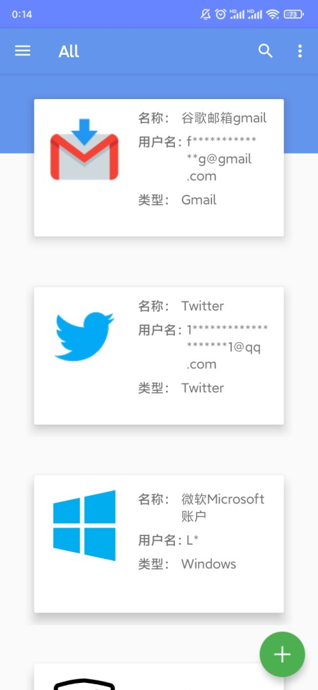

# Puff - 密码管理器

在[Puff@v1.2](https://github.com/PuffOpenSource/Puff-Android/releases/tag/v1.2)的基础上做了一些定制化的修改，适配了Android 11

## 说明

- puff不需要联网权限，所以数据都在本地不会通过网络传输到服务器，但是需要本地存储权限
- puff通过`Blowfish Encryption`对称加密算法将账号密码加密后存储在手机本地的数据库中，对称加密算法的密钥就是puff中所要求用户设置的*主密码*，所以如果忘记主密码将不能恢复数据。
- 导出数据库：导出.db后缀的数据库文件，可以在另一台设备上使用【导入数据库】进行导入，**注意：导入后的数据仍然需要用原主密码才能解密**。也就是说如果你导出了原设备的数据库，但是忘记了原主密码，那导入后也还是查看不了账户信息。

## 定制化修改截图

|  |  |  |
| :-------------------------------------: | :-------------------------------------------: | :---------------------------------------: |
|             带搜索的主界面              |                    All类型                    |                导入数据库                 |

